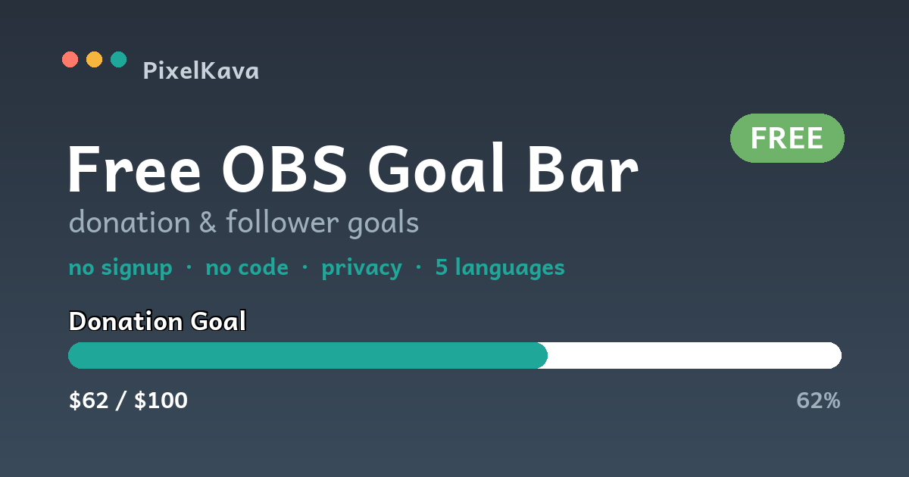

# 🎯 PixelKava Goal Bar — free OBS goal widget

A free, **no-signup, no-code** goal bar widget for **OBS / Twitch** (donation or follower goals).
Set it up in the visual builder, copy the link, and add it as a **Browser Source**. That's it.

## ✨ Features
- 🆓 **Free, no sign-up, no code**
- 🌍 **5 languages** (English, Українська, Español, Português, Deutsch) with auto-detect
- 🎨 Customizable: title, current/goal, prefix/suffix, color themes or custom color, bar style (rounded / flat / striped), text color, height
- 🏁 **Milestones**, **message at 100%**, smooth animation, shine, celebration glow
- 💾 Auto-saves your setup · import settings from an existing link
- 🔒 **Privacy-first:** no tracking, no cookies, no data collection, strict CSP

## 🚀 How to use
1. Open the **builder** (`index.html`) — or the hosted page.
2. Configure your goal and style (live preview).
3. Click **Copy link**.
4. In OBS: **Sources → + → Browser** → paste the link (size ~600×150).
5. Done! To update the number, change *Current* and paste the new link.

## 🔧 Widget parameters (`goal.html?...`)
`label` · `current` · `goal` · `prefix` · `suffix` · `theme` (teal/coral/sun/lilac/green) · `color` (custom hex) · `bg` · `text` · `height` · `style` (rounded/flat/striped) · `milestones` (comma-separated values) · `done` (message at 100%) · `showvalues` (1/0)

## 🔐 Privacy & security
Fully static — no backend, no third-party libraries, no analytics by default, nothing leaves your browser. Hardened with a Content-Security-Policy and `noopener`. See the project's security checklist.

## 🗺️ Roadmap
- v2: **live auto-update** (Ko-fi / StreamElements via a serverless function)
- More widgets: *Starting Soon* timer, recent followers, sub goal, now playing
- **Localized culture theme packs** (vyshyvanka / regional) — premium

## 💛 Support
Free for streamers to use. If it helps, you can support development:
**ko-fi.com/pixelkava**

---
© 2026 **PixelKava** · made with care 🌻 · free to use on your streams (please don't resell as your own)
